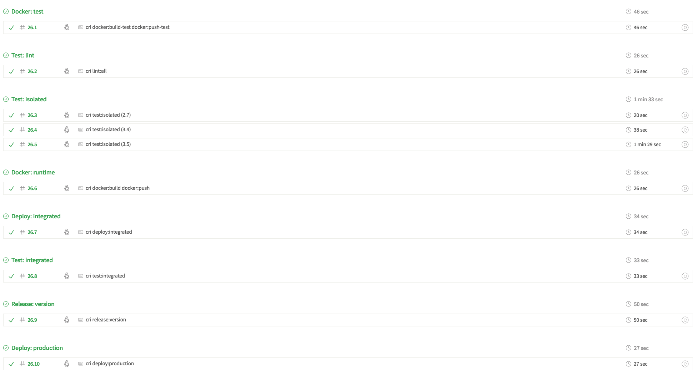

# Continuous Integration

This document outlines how the [Continuous Integration](https://en.wikipedia.org/wiki/Continuous_integration) workflow works relative to the other extensions.

## Extension

There is no explicit extension for the CI workflow as it is an amalgamation of other extensions.

### Extensions Used

The following is a list of extensions used within the CI workflow:

* [Docker](docs/docker.md)
* [Test](docs/test.md)
* [Lint](docs/lint.md)
* [Release](docs/release.md)
  * [Bump](docs/bump.md)
  * [Changelog](docs/changelog.md)

### Related

The following is a list of related documents you might be interested in reading:

* [Continuous Deployment](docs/cd)

## Implementations

The CI workflow is implemented by specific CI tools/services. The following are supported:

* [TravisCI](docs/travis-ci.md)

## Workflow

The outline of the CI workflow will use Travis CI as the main example. However, most, if not all, CI systems can be used to define the workflow using their own primitives.

### Configuration

The following is an example of the CI workflow represented as a Travis CI YAML configuration file.

```yaml
sudo: true
language: python

python: '3.5'

before_install: "cri travis-ci:before-install"
install: "cri travis-ci:install"
before_script: "cri travis-ci:before-script"
script: "cri travis-ci:script"
before_cache: "cri travis-ci:before-cache"
after_success: "cri travis-ci:after-success"
after_failure: "cri travis-ci:after-failure"
before_deploy: "cri travis-ci:before-deploy"
deploy: "cri travis-ci:deploy"
after_deploy: "cri travis-ci:after-deploy"
after_script: "cri travis-ci:after-script"

jobs:
  include:
  - stage: "Docker: Isolated"
    name: "cri docker:build-isolated docker:push-isolated"
    script: "cri docker:build-isolated docker:push-isolated"
  - stage: "Test: Isolated"
    name: "cri lint:all"
    script: "cri lint:all"
  - stage: "Test: Isolated"
    name: "cri test:isolated (2.7)"
    script: "cri test:isolated"
    python: "2.7"
  - stage: "Test: Isolated"
    name: "cri test:isolated (3.4)"
    script: "cri test:isolated"
    python: "3.4"
  - stage: "Test: Isolated"
    name: "cri test:isolated (3.5)"
    script: "cri test:isolated"
    python: "3.5"
  - stage: "Docker: Integrated"
    name: "cri docker:build-integrated docker:push-integrated"
    script: "cri docker:build-integrated docker:push-integrated"
  - stage: "Deploy: Integrated"
    name:  "cri deploy:integrated"
    script: skip
    deploy:
      provider: script
      script: "cri deploy:integrated"
      skip_cleanup: true
  - stage: "Test: Integrated"
    name: "cri test:integrated"
    script: "cri test:integrated"
  - stage: "Release: Create"
    if: branch = master AND tag = ""
    name: "cri release:version"
    script: "cri release:version"
  - stage: "Docker: Production"
    name: "cri docker:build-production docker:push-production"
    script: "cri docker:build-production docker:push-production"
    if: branch = master AND "tag =~ /(\d+\.)?(\d+\.)?(\*|\d+)$/"
  - stage: "Deploy: Production"
    name: "cri deploy:production"
    script: skip
    if: branch = master AND "tag =~ /(\d+\.)?(\d+\.)?(\*|\d+)$/"
    deploy:
      provider: script
      script: "cri deploy:production"
      skip_cleanup: true
      on:
        branch: master
        tags: true
        condition: $TRAVIS_TAG =~ /(\d+\.)?(\d+\.)?(\*|\d+)$/
stages:
  - name: "Docker: Isolated"
  - name: "Test: Isolated"
  - name: "Docker: Integrated"
  - name: "Deploy: Integrated"
  - name: "Test: Integrated"
  - name: "Release: Create"
    if: branch = master
  - name: "Docker: Production"
    if: branch = master AND "tag =~ /(\d+\.)?(\d+\.)?(\*|\d+)$/"
  - name: "Deploy: Production"
    if: branch = master AND "tag =~ /(\d+\.)?(\d+\.)?(\*|\d+)$/"
```

### Visualization



### Terminology

#### Stages

Each stage is executed sequentially, e.g. "Docker: Isolated" **MUST** run before "Test: Lint". This means that stages with dependencies **MUST** be defined after the stages it depends on.

If a stage results in a **FAILURE** or **ERROR**, all subsequent stages **MUST** be skipped and not run.

#### Jobs

A stage is composed of one or more jobs. Jobs within a single stage may run sequentially or concurrently. For example, Travis CI will run these jobs concurrently.

If a job results in a **FAILURE** or **ERROR**, the stage it's defined in will have the same result.

#### Phases

Each job within each stage will run through a set of the phases:

* before_install
* install
* before_script
* script
* before_cache
* after_success
* after_failure
* before_deploy
* deploy
* after_deploy
* after_script

If a phase results in a **FAILURE** or **ERROR**, the job/stage it's defined in will have the same result.

### Stage: "Docker: Isolated"

The first stage of the CI workflow. This stage is responsible for building a Docker image used to run linters and isolated tests. This is done by invoking the following targets:

* `cri docker:build-isolated` - Build Docker isolated image
* `cri docker:push-isolated` - Push Docker isolated image to repository

Within those two targets, a Docker image is built, using `--target isolated`. This means that the `Dockerfile` must use [multi-stage builds](https://docs.docker.com/develop/develop-images/multistage-build/) and support a `isolated` stage. The goal of this Dockerfile stage is to build an image that is capable of running both `cri test:isolated` and `cri lint:all` targets.

This is a separate Dockerfile stage as the dependencies necessary to run linting checks and isolated tests should **NEVER** be available in a production image.

**Expectations:**

* This stage will run on **ALL** branches and **ALL** pull-requests.
* This stage is expected to tag the Docker image appropriately so it can be deployed into a isolated environment.

**Conditions:**

* This stage is the first of the workflow and is always run.

**Success:**

If this stage succeeds, it means that there is a image built from the `isolated` target located in the Docker image repository that can be used for future stages in the CI workflow.

**Failure:**

This stage will fail if it fails to build the Dockerfile `isolated` target **OR** fails to push it to the image repository.

If this stage fails, no other stages will run.

### Stage: "Test: Isolated"

The second stage of the CI workflow. This stage is responsible for the running linting and isolated tests against all language versions supported by the repository.

Prior to running this stage, it should pull down and validate access to the isolated image created in the "Docker: Isolated" stage.

* `cri lint:all` - Run all linters
* `cri test:isolated` - Run all isolated tests (capable of succeeding with no external dependencies)

**Expectations:**

* This stage will run on **ALL** branches and **ALL** pull-requests that successfully perform the previous stages.
* If this stage completes successfully, the expectation is that the code change is high quality.

**Conditions:**

* If the "Docker: Isolated" stage is successful.

**Success:**

If this stage succeeds, it means that all linters and isolated tests have succeeded. We have a decent level of confidence in the code change that we are trying to integrate.

**Failure:**

This stage will fail if any of the lint or isolated test jobs fail.

If this stage fails, no other stages will run.

### Stage: "Docker: Integrated"

The third stage of the CI workflow. This stage is responsible for building a Docker image used to run integrated tests. This is done by invoking the following targets:

* `cri docker:build-integrated` - Build Docker isolated image
* `cri docker:push-integrated` - Push Docker isolated image to repository

Within those two targets, a Docker image is built, using `--target integrated`. This means that the `Dockerfile` must use [multi-stage builds](https://docs.docker.com/develop/develop-images/multistage-build/) and support a `integrated` stage. The goal of this Dockerfile stage is to build an image that is capable of running the `cri test:integrated` target.

This is a separate Dockerfile stage as the dependencies necessary to run the integrated tests should never be available in a production image.

If no additional dependencies are necessary to run the integrated tests, this can be a duplicate of the `production` target.

**Expectations:**

* This stage will run on **ALL** branches and **ALL** pull-requests that successfully perform the previous stages.
* This stage is expected to tag the Docker image appropriately so it can be deployed into an integrated environment.

**Conditions:**

* If the "Test: Isolated" stage is successful.

**Success:**

If this stage succeeds, it means that there is a image built from the `isolated` target located in the Docker image repository that can be used for future stages in the CI workflow.

**Failure:**

This stage will fail if it fails to build the Dockerfile `integrated` target **OR** fails to push it to the image repository.

If this stage fails, no other stages will run.

### Stage: "Deploy: Integrated"

The fourth stage of the CI workflow. This stage is responsible for deploying the Docker image built in the previous stage into an _integrated_ environment. An _integrated_ environment is one that is running all external dependencies necessary for the integrated tests to succeed.

Prior to running this stage, it should pull down and validate access to the `integrated` target image created in the "Docker: Integrated" stage.

This is completed by invoking the following targets:

* `cri deploy:integrated` - Deploy Docker image to environment where it has access to its external dependencies

**Expectations:**

* This stage will run on **ALL** branches and **ALL** pull-requests that successfully perform the previous stages.
* This stage expects that `integrated` environments can be created/destroyed in relatively short order.
* This stage expects that **MANY** `integrated` environments can run at the same time without impacting each other.

**Conditions:**

* If the "Docker: Integrated" stage is successful.

**Success:**

If this stage succeeds, it means that the image created by the "Docker: Integrated" stage has successfully been deployed into an integrated environment where it can be tested.

**Failure:**

This stage will fail if it fails to deploy the Docker image built in the "Docker: Integrated" stage to an integrated environment.

If this stage fails, no other stages will run.

### Stage: "Test: Integrated"

The fifth stage of the CI workflow. This stage is responsible for running integrated tests against the Docker image built by the "Docker: Integrated" stage in an integrated environment. This means that the running Docker image has access to all of its external dependencies. This is completed by invoking the following targets:

* `cri test:integrated` - Runs all integrated tests that rely on external dependencies

**Expectations:**

* This stage will run on **ALL** branches and **ALL** pull-requests that successfully perform the previous stages.
* If this stage completes successfully, the expectation is that the code change is high quality and should merge into production **WITHOUT** any issue.

**Conditions:**

* If the "Docker: Integrated" stage is successful.

**Success:**

If this stage succeeds, it means that the image created by the "Docker: Integrated" stage has successfully run its integrated tests without failure.

**Failure:**

This stage will fail if there are any integrated test failures.

If this stage fails, no other stages will run.

### Stage: "Release: Create"

The sixth stage of the CI workflow. This stage is responsible for creating a "release" in the repository, which in turn, starts the process for a production deployment. A "release" consists of performing the following actions:

* Bumping the repository version based on [semver](https://semver.org) conventions
* Updating the repository changelog
* Creating a repository tag
* Commit/push changes to the remote repository
* Tag the image created in "Docker: Integrated" stage with new version
* Push tagged Docker image to repository

These actions are performed by invoking the following targets:

* `cri bump:(patch|minor|major)` - Bump the version based on build environment context
* `cri changelog:create` - Create a new changelog based on merged commits
* `cri git:tag` - Create a new git tag using the new commits
* `cri git:push-tags` - Push newly created release tag to remote
* `cri docker:tag` - Tag image using latest repository version
* `cri docker:push-tags` - Push tagged image to repository

**Expectations:**

* This stage will run **ONLY** on untagged versions of the `master` branch.
* The actions of this stage will start another CI workflow job that will perform the final deployment to production.

**Conditions:**

* If the "Test: Integrated" stage is successful.
* If the current build is using an un-tagged `master` branch.

**Success:**

If this stage succeeds, it means that a new "release" has been created and the repository meta-data has been updated.

**Failure:**

This stage will fail if it fails to update the version, changelog or push release tag to repository remote.

If this stage fails, no other stages will run.

### Stage: "Docker: Production"

The seventh stage of the CI workflow. This stage is responsible for building a Docker image used to run production environments. This is done by invoking the following targets:

* `cri docker:build-production` - Build Docker production image
* `cri docker:push-production` - Push Docker production image to repository

Within those two targets, a Docker image is built, using `--target production`. This means that the `Dockerfile` must use [multi-stage builds](https://docs.docker.com/develop/develop-images/multistage-build/) and support a `production` stage. The goal of this Dockerfile stage is to build an image that is lightweight and capable of running in production environments.

This is a separate Dockerfile stage as the dependencies necessary to run the isolated and integrated tests should **NEVER** be available in this image.

**Expectations:**

* This stage will run on **ONLY** tagged versions of the `master` branch.
* This stage expects that the "Release: Create" stage was successfully run on a prior build of the un-tagged `master` branch.
* This stage is expected to tag the Docker image appropriately so it can be deployed into the production environment.

**Conditions:**

* If the "Test: Integrated" stage was successful on the current build.
* If the "Release: Create" stage was successful on a previous build (PR merge to master).

**Success:**

If this stage succeeds, it means that there is a image built from the `production` target located in the Docker image repository that can be used in production environments.

**Failure:**

This stage will fail if it fails to build the Dockerfile `production` target **OR** fails to push it to the image repository.

If this stage fails, no other stages will run.

### Stage: "Deploy: Production"

The eighth stage of the CI workflow. This stage is responsible for deploying the Docker image built in the "Docker: Production" stage into a _production_ environment. A _production_ environment is one that is running an accessible by non-company users.

Prior to running this stage, it should pull down and validate access to the `production` target image created in the "Docker: Production" stage.

This is completed by invoking the following targets:

* `cri deploy:production` - Deploy Docker image to a production environment

**Expectations:**

* This stage will run on **ONLY** tagged versions of the `master` branch that follow [semver](https://semver.org) naming conventions.
* This stage is expected to deploy the image created in the "Docker: Production" to a production environment.

**Conditions:**

* If the current build is using a tagged `master` branch that follows [semver](https://semver.org) naming conventions.
* If the "Docker: Production" stage was successful on the current build.

### Future Considerations

The following is a working list of items up for potential consideration in the future:

* How does this plug into deployment management?
  * Spinnaker?
  * Rolling, Canary, Blue/Green Deployments?
  * Rollbacks?
  * Configuration Management?
  * Infrastructure changes?
  * Kubernetes? Helm?
  * Secrets?

## Links

Prior art, additional documentation, thoughts, etc.

* https://medium.com/@tonistiigi/advanced-multi-stage-build-patterns-6f741b852fae
